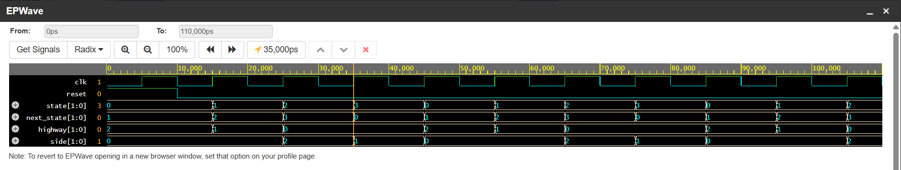

# Traffic Light Controller using Verilog

## Overview
This project implements a Traffic Light Controller using a Finite State Machine (FSM) in Verilog HDL.

## Features
FSM-based design
Sequential logic implementation
Verilog RTL coding
Testbench simulation

## Files
traffic_light.v : RTL design  
traffic_light_tb.v : Testbench for simulation  
waveform.png : Simulation waveform output

## Simulation Waveform

## Tools Used
Verilog HDL
EDA Playground
VS Code